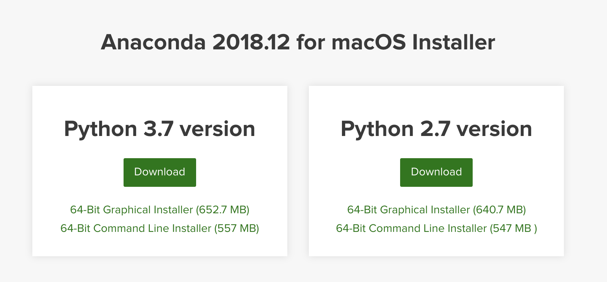
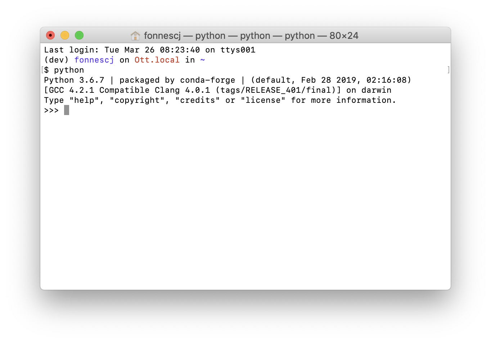
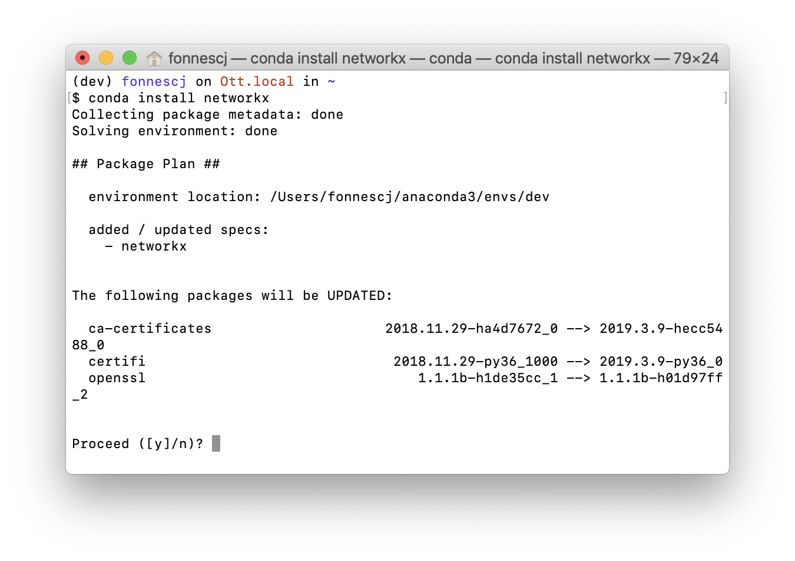
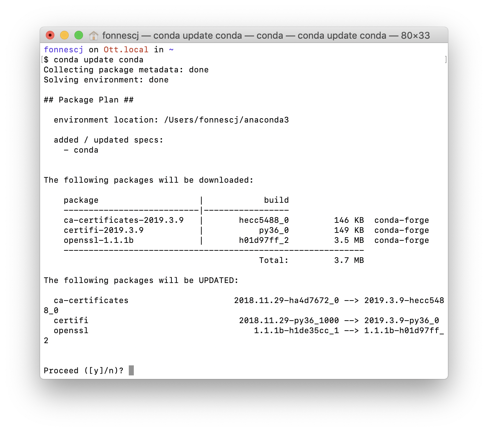
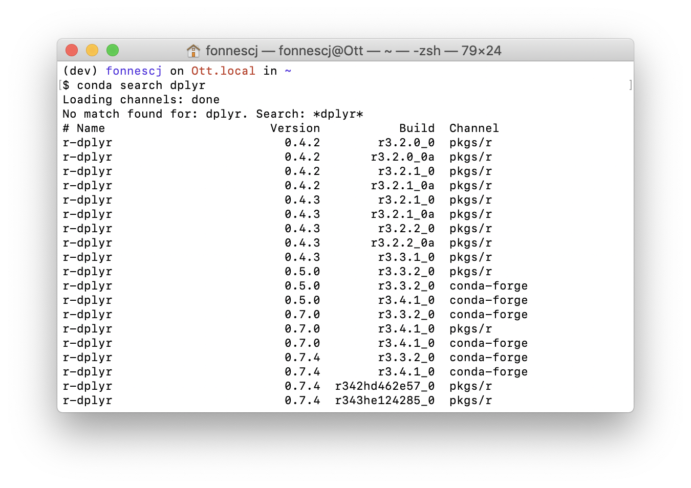
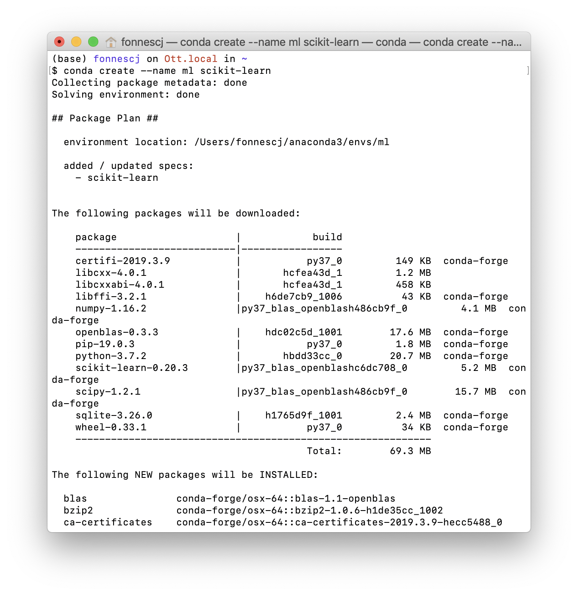
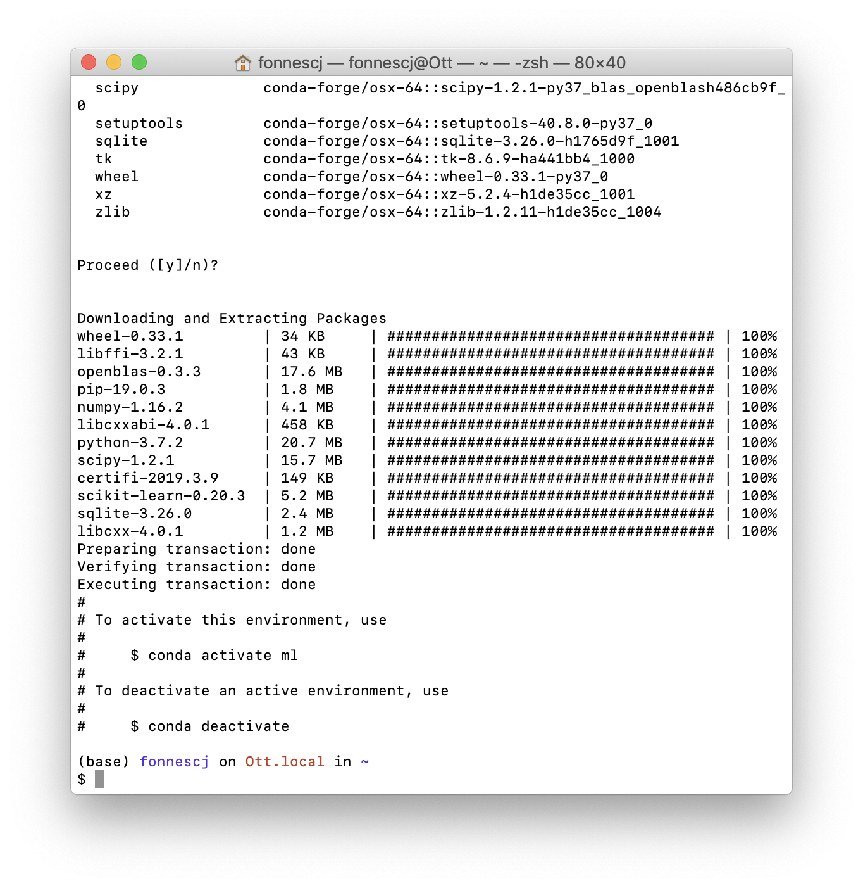
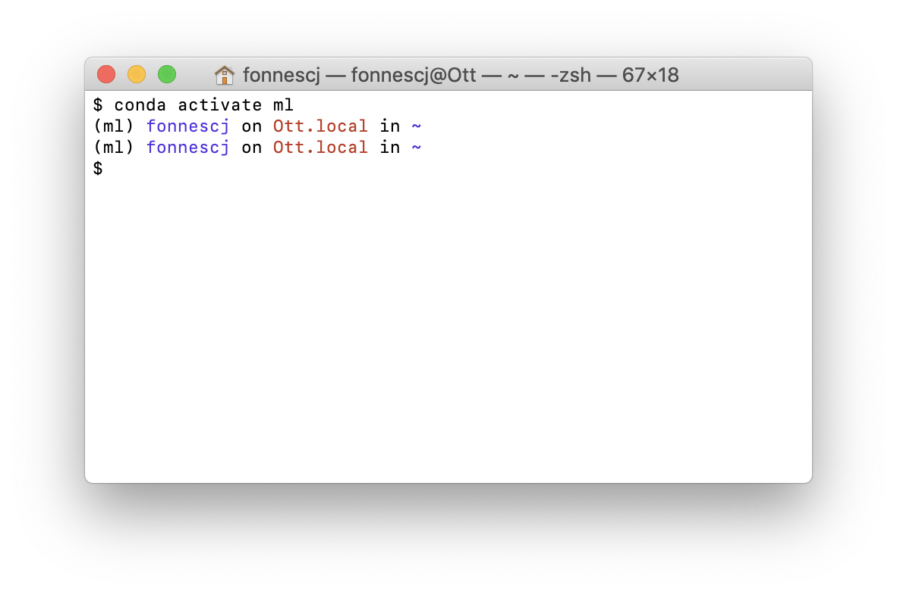

# Introdution to Bayesian Inference

### Chris Fonnesbeck
Senior Quantitative Analyst, The New York Yankees

## Getting Python

How do you obtain and configure Python?

Python comes pre-installed on some systems, but I recommend using the [Anaconda](https://www.anaconda.com) distribution because it includes enhancements that make configuring and maintaining Python on your computer much easier. Anaconda is freely available from the [Anaconda download page](https://www.anaconda.com/distribution/#download-section).

Download the Python 3.7 installer for your system, and execute the file, following the on-screen instructions.

### System requirements

- Operating system: Windows 7 or newer, 64-bit macOS 10.10+, or Linux, including Ubuntu, RedHat, CentOS 6+, and others.
- If your operating system is older than what is currently supported, you can find older versions of the Anaconda installers in our archive that might work for you.
- System architecture: Windows- 64-bit x86, 32-bit x86; MacOS- 64-bit x86; Linux- 64-bit x86, 64-bit Power8/Power9.
- Minimum 5 GB disk space to download and install.

On Windows, macOS, and Linux, it is best to install Anaconda for the local user, which does not require administrator permissions and is the most robust type of installation. 

During the installation, you will be asked if Anaconda should modify the PATH variable on your machine. It is recommended that you allow this, as it permits Anaconda to become the default Python installation on your machine, incase there are other versions already on your system.

Once installed, you can run Python from either the native terminal (macOS or Linux) or the Anaconda Prompt (Windows).

### conda

One of the great advantages to using the Anaconda Python distribution is the `conda` utility that is bundled with it. Conda is a powerful package manager and environment manager that you use with command line commands at the Anaconda Prompt for Windows, or in a terminal window for macOS or Linux.

For example, we can use it to install third-party packages via `conda install`:

Or it can be used to update packages that are already installed:

And if you are unsure about whether a package is available in the Conda repository, you can search for it:

### conda environments

Conda allows you to create separate environments containing files, packages and their dependencies that will not interact with other environments.

When you begin using conda, you already have a default environment named base. You don't want to put programs into your base environment, though. Create separate environments to keep your programs isolated from each other.

For example, we can create a new environment and install a package in it:

Conda will determine the dependencies of any package that you specify for installation, and install them as well. 

(via [xkcd](https://xkcd.com/1987/))

Once created, Conda tells you how to activate the environment, via `conda activate`.

The repository for this tutorial contains a file called `environment.yml` that includes a list of all the packages used for the tutorial. If you run

    conda env create
    
in the directory containing `environment.yml` it will create the environment for you and install all of the packages listed.

